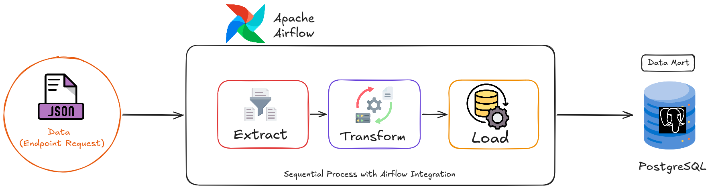

# Data Engineering Pipeline (Data Mart)

An enterprise-ready, containerized Data Engineering project that automates the End-to-End ETL (Extract, Transform, Load) process. This pipeline requests user data from a remote REST API (`DummyJSON`), performs object-oriented structural transformations and validations using Pandas, and securely loads the clean data into a PostgreSQL Data Mart—all orchestrated seamlessly by Apache Airflow.

## 📌 Architecture & Workflow



1. **`Extract`**: Ingestion of raw nested JSON data from the source API endpoint.
2. **`Transform`**: Implementation of an OOP-based data processor for schema filtering, data deduplication, camelCase to snake_case column remapping via Regex, and automated missing value logging.
3. **`Load`**: Programmatic target delivery via SQLAlchemy to a Dockerized PostgreSQL instance.
4. **`Orchestration`**: The entire workflow is managed as a Directed Acyclic Graph (DAG) inside Apache Airflow utilizing PythonOperators and task dependencies.

---

## 🛠️ Tech Stack & Prerequisites

Before initiating setup, ensure your machine has the following tools installed:

- **`Infrasctructure`**: Docker & Docker Compose
- **`Orchestration`**: Apache Airflow 2.8+ (SequentialExecutor)
- **`Data Core`**: Python 3.10+, Pandas, SQLAlchemy, PostgreSQL 16

---

## 🚀 Step-by-Step Local Deployment

### 1. Clone the Repository & Environment Setup

Clone this repository to your local system.

```bash
git clone https://github.com/rachmanz/Data-Engineering-Pipeline.git
```

Next, duplicate the `.env.example` file and rename it to `.env`:

```bash
cp .env.example .env
```

Open the `.env` file and input your desired secure credentials:

```ini
POSTGRES_USER=your_custom_user
POSTGRES_PASSWORD=your_secure_password
POSTGRES_DB=de_project
```

### 2. Configure Directory Permissions (Linux/macOS/PowerShell)

To prevent internal Docker container write-failures (`PermissionError`), authorize localized volume mounts:

```bash
sudo chmod -R 777 logs dags src sql

```

### 3. Initialize & Launch Infrastructure

Deploy the ecosystem in detached mode:

```bash
docker compose up -d

```

### 4. Create an Airflow Admin Account

Generate your credentials to bypass the default single-use standalone secret:

```bash
docker exec -it de-airflow airflow users create \
    --username superadmin \
    --firstname Data \
    --lastname Engineer \
    --role Admin \
    --email admin@de_project.com \
    --password rahasia123
```

---

## 🖥️ Verifying Data Ingestion

### Airflow Orchestrator WebUI

Access the Airflow graphical interface at **`http://localhost:8080`**. Sign in using the credentials generated in Step 4. Activate the `enterprise_etl_users_pipeline` toggle switch and trigger the DAG.

### Target Database Validation

To verify data delivery directly through your terminal, enter the active PostgreSQL container instance:

```bash
docker exec -it de-postgres psql -U postgres -d de_project

```

Query the ingested data structure:

```sql
-- List existing relations
\dt

-- Read target table rows
SELECT id, first_name, last_name, email, university FROM users_etl LIMIT 5;
```

## 💡 Advanced Configurations & Analytics

### 1. Custom Infrastructure Build

- **`airflow.Dockerfile`**: Used to build a customized Apache Airflow image, pre-installing corporate-level Python dependencies (`pandas`, `sqlalchemy`, `psycopg2-binary`) directly into the container filesystem for faster boot times.
- **`postgres-init.sql`**: Configured as a Docker entrypoint script to automatically provision raw database schemas, user roles, or permissions immediately during the initial PostgreSQL container spin-up.

### 2. Post-Ingestion Analytics (`sql/analytics_queries.sql`)

Once the Airflow DAG successfully populates the target database, you can execute data analysis directly in PostgreSQL using our optimized analytics script. It includes queries for:

- User demographic segmentation (e.g., counting users by `university`).
- Missing values auditing and data quality checks.
- String pattern profiling (e.g., validating formatted phone numbers or emails).

---

**`Note`**: _The project still have more improvement to created solid integration_

**Created**: `RahmanDevs - 2026`
